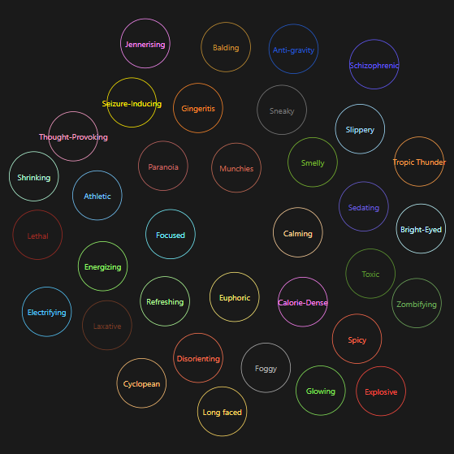
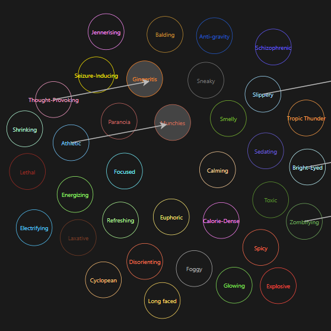

# Schedule One Mix Calculator

Unlike all the other mix calculators, this one implements the same algorithm
that Schedule One uses to calculate mixes. I reverse-engineered the game's
binary to discover how this algorithm worked. This calculator includes
an interactive visualization of the algorithm and some info on how it works.

You can see this calculator at https://mix.ooo.

## The Mixing Algorithm

The mixing algorithm computes new properties by transforming existing properties
in a 2D "effect space." This effect space is defined by a mixer map, like



The circles are "effects," which have a position, radius, and property. Each
effect is labeled by its property.

The mixing algorithm accepts a list of
existing properties from the input drug and a property to be added, taken
from the ingredient being mixed. Each property defines a mix direction vector.
When a new property is added, this direction vector is added to each existing
effect's position (on the mixer map). If the vector sum would land in another
effect's circle, then that existing effect is replaced.



_This mix has thought-provoking, athletic, slippery, bright-eyed, and 
zombifying. When sedating (flu medicine) is added, thought-provoking is 
replaced with gingeritis, and athletic is replaced with munchies. There are
only six effects and the mix does not yet have sedating, so sedating will be
added._

If the mix has less than 8 effects, and if it does not already have the new
property, then the new property is added to the mix.

### Notes

 - Each base drug (weed, meth, coke) has a mixer map, but it happens that all of
   these mixer maps are identical, at least for now.
 - Mixer maps also have a radius of their own. This radius encompasses all of
   the effects in the mixer map, and it's used solely as an early-out in
   the property replacement check.
 - It's impossible to get a lethal mix with the current set of mix ingredients.
   There is no mix ingredient property whose direction can be added to any
   effect to produce lethal.

I discovered this by decompiling the game with [Il2CppDumper](https://github.com/Perfare/Il2CppDumper)
and [Ghidra](https://github.com/NationalSecurityAgency/ghidra). I ran the game
with [WinDbg](https://learn.microsoft.com/en-us/windows-hardware/drivers/debugger/)
to inspect memory and better understand the core data model. To that end I
wrote [SynTypesTS](https://github.com/Dezzmeister/SynTypesTS) to inspect
flex array members in WinDbg and export data as JSON.

## Building

1. Clone the repo and install NodeJS 22. You might be able to make other
   versions of Node work, but I developed this with v22.16.0.

2. Install dependencies

   ```sh
   npm i
   ```

3. Start the development server

   ```sh
   npm run dev
   ```

There are also a few scripts you can run to generate the JSON used
by the app:

```sh
npm run transform-data
```
This generates model.json, which contains the mixer map and ingredient
list in a format that the app can easily work with.

```sh
npm run find-combos
```
This generates combomap.json, which contains lists of the property reactions
that produce each effect.

## TODOs

 - "x" buttons on ingredients
 - Page icons